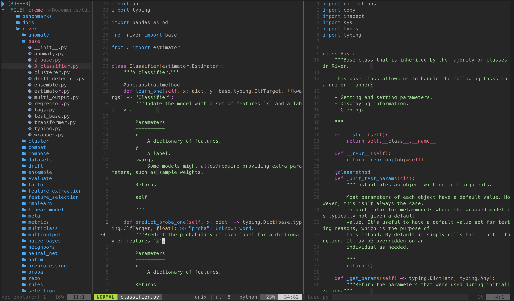
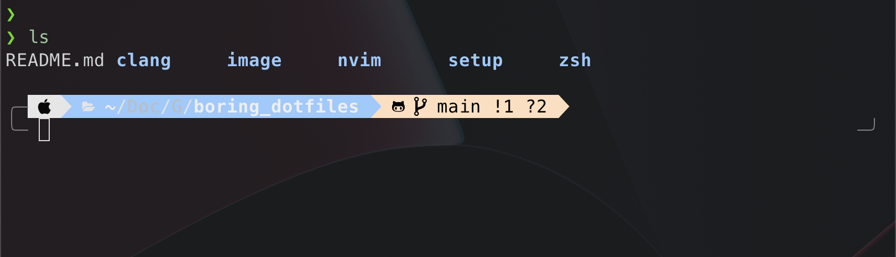

# boring_dotfiles
 My personal and boring dotfiles 

## Nvim



**You need before installing my config:**

**NeoVim**:

- `sudo apt install neovim` on Debian
- `brew install neovim` on MacOs

**Clang (llvm)**:

- `sudo apt install llvm` on Debian
- `brew install llvm` on MacOs

**rustup**: 
- `rustup component add rls rust-analysis rust-src`

**nodejs** >= 12.12 :

- `curl -sL install-node.vercel.app/lts | sudo bash`


**black**:
- `pip install black`
	
**Meslo nerd font**:

```
wget https://github.com/ryanoasis/nerd-fonts/releases/download/v2.1.0/Meslo.zip
unzip Meslo.zip -d ~/.fonts
# If you are on MacOs 
unzip Meslo.zip -d ~/Library/Fonts
fc-cache -fv
```

**Install my Boring NeoVim**: 

```
chmod +x setup/install_editor.sh
./setup/install_editor.sh
```
Update: 
```
chmod +x setup/update_editor.sh
./setup/update_editor.sh
```
ET VOILÀ !!


## Oh-My-Zsh




**You need before installing my config:**

**Install** `zsh`:
- `sudo apt install zsh` on Debian
_ `brew install zsh` on MacOs

**Install** `oh-my-zsh`:

- `sh -c "$(curl -fsSL https://raw.github.com/ohmyzsh/ohmyzsh/master/tools/install.sh)"`

**Install** `Powerline10k`:

- `git clone --depth=1 https://github.com/romkatv/powerlevel10k.git ${ZSH_CUSTOM:-$HOME/.oh-my-zsh/custom}/themes/powerlevel10k`

**Install** `exa`:

- `sudo apt install exa` on Debian
- `brew install exa` on MacOs
- `cargo install exa` with Cargo 

**Install my Boring Zsh**:
```
chmod +x setup/setup_zsh.sh
./setup/setup_zsh.sh
```
TADAAAAAA !!
